<div align="center">

<a href="https://portfolio-manager-by-atv.vercel.app/">
  
</a>

### Institutional Portfolio Intelligence & Autonomous Market Command Center

Sub-second exchange feeds · Real-time breakout scanner · Quantitative alpha models · Multi-source macro intelligence · Gemini 3.8 Flash catalyst reasoning

[**Explore Live Demo »**](https://portfolio-manager-by-atv.vercel.app/) • [**Key Features**](#-key-features) • [**Breakout Scanner**](#4--breakout-scanner--automated-daily-email-digest) • [**API Docs**](#-api-endpoints) • [**Quickstart**](#-installation--quickstart)

<br />

[](https://portfolio-manager-by-atv.vercel.app/)


[](https://github.com/tekurkaa)


</div>

---

# terminus

**TERMINUS** is a high-performance, full-stack financial market terminal designed for active equity traders, quantitative analysts, and portfolio managers. It combines sub-second live exchange market feeds, predictive alpha generation models, congressional trading intelligence, and automated breakout alerts in a sleek, dark-mode terminal interface.

---

## ✨ Key Features

### 1. 🟢 Sub-Second Streaming Market Ticker Strip & Session Countdown
- **Real-Time Exchange Data**: 0-second latency institutional feed for **NASDAQ 100** (`.NDX`), **S&P 500** (`.SPX`), **Dow Jones** (`.DJI`), **Russell 2000** (`.RUT`), **10-Year Treasury Yield** (`US10Y`), **Crude Oil** (`@CL.1`), **Gold** (`@GC.1`), **Silver** (`@SI.1`), **VIX** (`.VIX`), **US Dollar DXY** (`.DXY`), **Bitcoin**, **Ethereum**, and **Solana**.
- **Market Session Indicator & Live Countdown (`/api/market/status`)**: Real-time status badge showing current US equity market session (*Pre-Market*, *Market Open*, *After-Hours*, or *Closed/Weekend*) in Eastern Time with a live second-by-second countdown to the next session open or close.
- **Micro-Animations & Interactive Tickers**: Real-time green/red price flash pulse animations on price movement; clicking any ticker card instantly opens its detailed Bloomberg security analysis modal.
- **Infinite Marquee**: Seamless hover-to-pause scrolling ticker.

### 2. 📰 Multi-Source Stock & Macro Intelligence
- **Held Position News (`/api/news/stocks`)**: Real-time articles tagged by portfolio symbols (`AAPL`, `NVDA`, `TSLA`, `MSFT`, `BTC`, etc.) aggregating yfinance news, Yahoo Finance Ticker RSS feeds (`https://finance.yahoo.com/rss/headline?s={sym}`), and Google Financial News RSS.
- **Macroeconomic Intelligence (`/api/news/macro`)**: Curated macroeconomic wire aggregating high-authority direct RSS feeds and targeted search queries:
  - **CNBC Economy & Finance Feeds**: Live reporting on central bank moves, debt markets, and economic prints.
  - **Federal Reserve Monetary Policy Press Releases**: Official FOMC announcements directly from `federalreserve.gov`.
  - **Google Financial News**: Targeted macro search queries covering interest rates, trade war/tariffs, 10-year Treasury yields, crude oil OPEC actions, CPI/PPI inflation, and geopolitics.
- **NewsAPI Integration**: Optional auto-enrichment via NewsAPI.org when key is present.
- **Zero-Key Operational Resilience**: Operates at 100% capability without requiring any paid subscriptions or external API keys.

### 3. 🌡️ Market Sentiment & Institutional Fear & Greed (`/api/sentiment/portfolio`)
- **Official CNN Fear & Greed Index**: Direct integration with CNN's institutional market data endpoint providing the benchmark 0–100 composite index, qualitative rating (*Extreme Fear*, *Fear*, *Neutral*, *Greed*, *Extreme Greed*), historical comparisons (Previous Close, 1 Week Ago, 1 Month Ago), and 7 underlying market metrics:
  - Market Volatility (VIX)
  - Put and Call Options Ratio
  - Stock Price Breadth
  - Safe Haven Demand
  - Junk Bond Demand
- **Alternative.me Crypto Fear & Greed Index**: Real-time crypto market sentiment tracking.
- **ApeWisdom Reddit Intelligence**: Live sentiment tracking across `r/wallstreetbets`, `r/stocks`, `r/investing`, and `r/crypto` bypassing Reddit's anti-scraping blocks to provide verified Reddit mentions, upvotes, and WSB trending ranks.
- **StockTwits Real-time Stream**: Micro-sentiment and retail message velocity integration per security.


### 4. 🎯 Breakout Scanner & Automated Daily Email Digest
- **Cross-Sector Scanning**: Scans 60+ high-momentum equities (semis, mega-cap tech, biotech, crypto proxies) combining price momentum, 52-week breakout proximity, unusual call options flow, recent congressional purchases, and live breaking news velocity.
- **Catalyst Intelligence & Live News Layer (`news_intelligence.py`)**:
  - **12-Category Catalyst Keyword Dictionary**: Tracks market-moving events across 3 impact tiers:
    - *Tier 1 (10 pts)*: Regulatory / FDA approvals, Clinical Trial breakthroughs, Mega M&A agreements, Landmark commercial/hyperscaler contracts, Guidance raises & record quarters.
    - *Tier 2 (6 pts)*: Pipeline & product milestones, Strategic corporate actions (spin-offs, activist stakes), Index inclusions (S&P 500), AI / technology inflection events.
    - *Tier 3 (3 pts)*: Analyst upgrades & price target hikes, Macro sector tailwinds, Pre-earnings whispers.
  - **Exponential Recency Decay Model**: Multiplies catalyst score by $e^{-0.08 \times \text{hours}}$, prioritizing breaking news (< 1h) while fading articles over 48 hours to prevent stale news from distorting scores.
  - **Source Credibility Weighting**: Tiered multipliers from 1.0× (WSJ, Bloomberg, Reuters, FT, CNBC) down to 0.5× for generic aggregators.
  - **News Velocity Bonus**: Awards an additional +3 points when $\ge 3$ articles cover the same security in a 4-hour window, capturing institutional media convergence.
  - **SEC EDGAR 8-K Monitor**: Real-time inspection of official SEC submissions (`data.sec.gov`) detecting material catalysts *before* broad dissemination.
  - **Finnhub Earnings Calendar**: Identifies upcoming earnings dates within 14 days, awarding pre-earnings momentum bonuses.
  - **Alpha Vantage News Sentiment Integration**: Incorporates article sentiment scoring (`NEWS_SENTIMENT`) for top candidates.
- **AI Breakout Thesis & Conviction Engine (Google Gemini 3.8 Flash)**:
  - Formulates institutional 1-2 sentence trade theses directly synthesizing real breaking headlines, catalyst drivers, technical setup, and volume confirmation.
  - Computes quantitative conviction scores (1–10) and catalyst classifications (*FDA Approval*, *Mega M&A*, *Pre-Earnings Squeeze*, *AI Inflection*, *Commercial Deal*, *Institutional Accumulation*).
  - Highlights trade theses and breaking news cards (with live article links, recency badges, and velocity tags) directly in the terminal UI and embeds them in daily HTML email digests.
- **Configurable Delivery Schedule & Live Tracking**:
  - **Customizable Delivery Time**: Select pre-market (08:30 AM ET, 09:15 AM ET), market open (09:30 AM ET), post-market (04:15 PM ET, 04:30 PM ET), or specify any custom minute (`HH:MM`).
  - **Timezone Awareness & UTC Rollover Guard**: Scheduler converts current time to the user's local timezone (via Python `zoneinfo.ZoneInfo`) and validates against local calendar dates (`YYYY-MM-DD`), preventing premature duplicate sends caused by UTC midnight rollover.
  - **Live Next-Run Indicator**: Real-time badge in the Email Alerts block displaying exact next scheduled dispatch (`Tomorrow, Oct 5 at 8:30 AM EDT`) and last delivery status.
  - **Precision Cron Scheduler**: 60-second polling loop with 12-hour minimum-interval safety guard.
- **Instant Dispatch**: One-click "Send Now" button from the Scanner tab with direct address targeting and automatic preference synchronization (`POST /api/scanner/notify` with optional `{ "email": "..." }`).

### 5. 🧠 Quantitative Alpha & Options Flow Signals
- **12-Factor Predictive Signal Engine**: Composite directional scoring (*STRONG BUY*, *BUY*, *HOLD*, *REDUCE*).
- **Options Flow & Tilt Tracker**: Tracks call-to-put volume ratios and institutional sweep alerts.
- **Congressional Trading Tracker**: Real-time monitoring of House and Senate financial disclosures.

### 6. 💼 Portfolio & Risk Management
- **Robinhood Activity Importer**: Native import for Robinhood Trade Activity CSVs with FIFO lot accounting, buy/sell parsing, and split/rebalance handling.
- **XIRR (Extended Internal Rate of Return) Engine**: True annualized personal money-weighted return accounting for exact dates and cash sizes of tax lots and purchases. High-precision zero-dependency Newton-Raphson polynomial root-solver with bounded bisection fallback and short-horizon guard.
- **Dedicated "DIVIDENDS" Tab**: Seamlessly positioned between Watchlist and Stock News, delivering an institutional upcoming ex-dividend schedule, payment dates, dividend rates, and an interactive **12-Month Projected Cash Flow Distribution** grid without cluttering the main portfolio overview.
- **Automated Backend Split & Merge Engine**: Built directly into portfolio capital calculations. Evaluates historical split events (e.g. NVDA 10:1 forward split, reverse split merges) against lot purchase dates to automatically adjust share counts and cost bases ($Q \times M$, $\text{Cost} / M$), conserving total deployed capital while ensuring P/L and valuations reflect live market reality.
- **Portfolio Risk & Diversification Auditor**: Single-asset dual-alert exposure thresholds (hard ceilings for crypto blue chips vs altcoins vs stocks), 20% sector concentration rules, health score scoring, and projected annual dividend cash flow KPIs.
- Real-time P&L calculations, historical equity curves (1D, 1W, 1M, 1Y, 5Y, ALL), and interactive allocation treemaps.
- Instant demo portfolio generation with 12 diversified tech, semi, ETF, and crypto positions.

### 7. 📈 Institutional Single-Stock Terminal Modal
- **Multi-Timeframe Interactive Charts**: Real-time quotes and intraday/historical charts across **`1D`**, **`1W`**, **`1M`**, **`1Y`**, and **`5Y`** intervals powered by Recharts with dynamic gain/loss area gradients.
- **Off-Hours & Low-Liquidity Intraday Resilience**: Multi-tier chart fallback engine: if 1D intraday interval is empty (e.g. market closed, weekend, or micro-cap equity), automatically extracts the most recent completed market session from a 5-day window, or daily bars, ensuring charts always render without blank states.
- **Visual Range Gauges**: High-contrast sliders displaying current price relative to **Day Low / High** and **52-Week Range**.
- **Institutional Key Metrics Grid**: Market Cap, Trailing P/E, Forward P/E, Beta (5Y), Day Open, Previous Close, Volume, and Dividend Yield with safe null/NaN defensive parsing.
- **Company Profile & Overview (Cloud-Resilient Metadata)**: Official descriptive company name and full business summary with expandable profile text. Incorporates a multi-tier fallback architecture combining Yahoo Finance, Alpha Vantage `OVERVIEW`, and an institutional master security directory in `asset_metadata_service.py` to guarantee official descriptive names and complete overview cards for equities, ETFs, and cryptocurrencies without bare symbol repetition or missing summaries even under datacenter IP restrictions.
- **Universal Cross-Tab Click Triggers**: Accessible anywhere a symbol appears across the entire terminal:
  - **Top Ticker Bar** & **Holdings Table**
  - **Watchlist Tab**
  - **Breakout Scanner Tab** (candidate symbols)
  - **Alpha Signals Tab** (directional models & options flow sweeps)
  - **Stock News Tab** (clickable article ticker tags)
  - **Sentiment Tab** (per-ticker sentiment breakdown cards)
  - **Insider Flow Tab** (congressional trades & top insider tickers)
  - **AI Chat Assistant Tab** (interactive extracted ticker chips)
  - **Portfolio Risk Auditor Tab** (trimmable asset chips & profit taking recommendations)
  - **Portfolio Charts Tab** (interactive allocation treemap tiles)
- **Actions**: One-click "Add to Watchlist" integration and keyboard `ESC` dismissal.

### 8. 🤖 Grounded AI Chat Assistant & Executive Briefs
- **Fintech Research Engine (Google Gemini 3.8 Flash)**: Multi-turn conversational AI grounded in live portfolio holdings, news events, congress transactions, and quantitative alpha signals.
- **Executive & Macro News Briefs**: Real-time AI executive summaries synthesizing key portfolio news and macroeconomic trends via high-throughput, low-latency reasoning models.
- **Auto-Ticker Extraction & Conversation Lifecycle**: Thread persistence, automated conversation creation/deletion, and clickable ticker references.

### 9. 🗄️ Dual-Mode Database Architecture
- **Zero-Friction Local Mode**: Automatically detects if MongoDB is running; if not available, gracefully falls back to an embedded JSON document store (`backend/data/local_storage.json`) within 1 second without hanging.
- **Production Mode**: Seamlessly switches to Cloud MongoDB (MongoDB Atlas) when `MONGO_URL` is configured.

### 10. 🎨 Institutional Design System & Accessibility (WCAG 2.1 AAA)
- **Accessible Navigation & Tab Semantics**: All 10 navigation tabs and sub-tab switchers feature explicit `aria-current="page"` indicators for screen readers and high-contrast `focus-visible:ring-2 focus-visible:ring-amber-500` rings for keyboard navigation.
- **Accessible Forms & Input Affordances**: Visible, uppercase monospace `<label htmlFor="...">` associations across trading and auth forms, native `type="email"` autofill, and descriptive `aria-label` tags on all icon-only action buttons.
- **Motion Safety (`prefers-reduced-motion`)**: Fully respects user motion preferences across all animations, pausing ticker marquees and disabling price flash pulses and tab fade transitions.
- **Terminal Depth & Numerical Alignment**: Enhanced panel elevation with inset highlight shadows (`.panel-raised`), vertical column alignment with `.tabular-nums` across tables and KPI cards (Watchlist, Dividends, Holdings), tactile press feedback (`active:scale-[0.97]`), custom dark Recharts tooltips, and safe inline two-step confirmation for destructive actions without native blocking dialogs.
- **Dialog Accessibility & Keyboard Trapping**: Complete `role="dialog"`, `aria-modal="true"`, `aria-labelledby`, and global `Escape` key dismissal across all modal surfaces (`StockDetailModal`, `DisclaimerModal`, `HowItWorksModal`, `CongressDrawer`).
- **Color-Independent Directional & Risk Encoding (WCAG 1.4.1)**: Directional indicators (`▲` / `▼`) alongside numeric values and explicit shape markers (`▲` High Exposure, `■` Warning, `●` Optimal) on risk badges so color is never the sole semantic differentiator.
- **Treemap Micro-Holding Aggregation**: Smart aggregation of positions accounting for <1% of the portfolio into an "OTHER (<1%)" bucket, preventing squished slivers and preserving aspect ratio visual clarity.
- **Full Skeleton Loading Pipeline**: Pulse-animated terminal skeleton loaders across historical charts and macro/stock news feeds that eliminate layout shifts during data fetches.
- **SVG & Visual Bar Accessibility**: Native SVG font styling ensuring monospace numbers across all browser engines, accompanied by `role="progressbar"` semantic attributes (`aria-valuenow`, `aria-valuemin`, `aria-valuemax`) on composite scores, sentiment meters, and sector allocation bars.

### 11. 🔐 Native Google Identity Services & Account Isolation
- **Direct Google OAuth 2.0**: Native integration with Google Identity Services (GIS) using official Google Client ID credentials, eliminating third-party proxy intermediaries.
- **Account Chooser Popup & Instant Session**: Clicking "Continue with Google" opens Google's native account chooser directly over the application without full-page navigation. Google ID tokens and access tokens are verified server-side against Google's public tokeninfo endpoints (`/api/auth/google`).
- **Complete Per-User Data Isolation**: Portfolios, watchlists, trade history, and custom scanner preferences are strictly partitioned per authenticated Google account in MongoDB.
- **Developer & Trader Quick Login**: Fallback instant email/trader authentication (`/api/auth/dev-login`) for rapid local development and automated CI/CD runs.

---

## 🛠️ Architecture & Tech Stack

```
portfolio-manager/
├── frontend/                # React 19 Single Page Application
│   ├── src/
│   │   ├── components/      # Terminal Tabs (TopTickerBar, Portfolio, Alpha, Scanner, News, Chat, etc.)
│   │   ├── lib/api.js       # Axios HTTP client with credentials & formatting utils
│   │   └── App.js           # Main terminal shell & auth state
│   └── vercel.json          # SPA rewrite rules for production
├── backend/                 # Python FastAPI Backend
│   ├── server.py            # REST API Routes, middleware & background scheduler
│   ├── quotes.py            # Parallelized real-time market data engine
│   ├── news_service.py      # Stock & macro financial news aggregator
│   ├── news_intelligence.py # Live breaking news velocity & 12-category catalyst scoring
│   ├── catalyst_service.py  # SEC 8-K monitor, earnings calendar & Gemini AI thesis engine
│   ├── scanner_service.py   # Breakout scoring engine & Resend email delivery
│   ├── signal_service.py    # Alpha models & options flow calculations
│   ├── trade_import_service.py # Robinhood trade activity CSV parser & lot accountant
│   ├── chat_service.py      # Grounded AI conversation engine
│   ├── insider_service.py   # Congressional trading integration
│   ├── auth.py              # Google OAuth 2.0 token verification & session manager
│   ├── db.py                # Dual-mode (MongoDB + Local JSON) database engine
│   └── .env                 # Environment configuration & API keys
├── specs/                   # QA test specifications (Given/When/Then format)
│   └── feature-tests.md     # Exhaustive 22-suite specification
├── tests/
│   ├── e2e/                 # Playwright TypeScript E2E test suite (144 tests across 30 suites)
│   ├── helpers/             # E2E test session bootstrap & database reset utilities
│   └── test_*.py            # Pytest backend integration test suite (88 tests)
├── playwright.config.ts     # Playwright configuration (workers: 1, dual backend/frontend webServers)
└── package.json             # Root dependencies & test scripts
```

---

## 🚀 Quickstart & Local Setup

### Prerequisites
- **Python 3.10+**
- **Node.js 18+** & **npm** (or **yarn**)

---

### Step 1: Clone the Repository
```bash
git clone https://github.com/tekurkaa/portfolio-manager.git
cd portfolio-manager
```

---

### Step 2: Set Up Backend

1. Create and activate a Python virtual environment:
   ```bash
   cd backend
   python3 -m venv venv
   source venv/bin/activate
   ```

2. Install dependencies:
   ```bash
   pip install -r requirements.txt
   ```

3. Configure your `.env` file (`backend/.env`):
   ```env
   MONGO_URL=mongodb://localhost:27017
   DB_NAME=portfolio_manager
   CORS_ORIGINS=http://localhost:3000,http://127.0.0.1:3000
   COOKIE_SECURE=false

   # API Keys (Optional integrations)
   ALPHA_VANTAGE_API_KEY=your_alpha_vantage_api_key_here
   NEWSAPI_KEY=your_newsapi_key_here
   RESEND_API_KEY=your_resend_api_key_here
   RESEND_FROM=Terminus <onboarding@resend.dev>
   ```

4. Start the backend server:
   ```bash
   python -m uvicorn server:app --host 127.0.0.1 --port 8000 --reload
   ```
   *Backend is now running at `http://127.0.0.1:8000`.*

---

### Step 3: Set Up Frontend

1. In a new terminal window:
   ```bash
   cd frontend
   npm install
   ```

2. Start the development server:
   ```bash
   npm start
   ```
   *Frontend is now live at `http://localhost:3000`.*

3. **Login**: Click **"Enter Terminal (Local / Demo)"** for instant one-click access with sample portfolio data.

---

## 🧪 Running the Test Suite

The project features a dual testing setup: backend unit/integration tests with **Pytest** and full end-to-end browser automation with **Playwright (TypeScript)**.

### 1. Backend Integration Tests (Pytest — 73 Tests)
Validates core API routes, dual-mode database CRUD, market quote streaming, trade activity import, scanner scoring, and catalyst intelligence:

```bash
# From the project root
./backend/venv/bin/pytest tests/
```

- `tests/test_catalyst_service.py`: SEC EDGAR 8-K parsing, CIK ticker map, Finnhub earnings calendar, Alpha Vantage news sentiment, and catalyst scoring.
- `tests/test_api_endpoints.py`: Auth dev-login, session cookies, Bearer tokens, `/api/portfolio/holdings`, trade activity import preview & commit, `/api/chat/*`, `/api/scanner/prefs`, `/api/scanner/notify`, `/api/scanner/breakouts`, market status, security details & history.
- `tests/test_xirr.py`: Unit and integration tests for Newton-Raphson XIRR solver, multi-lot cash flow timing, negative return scenarios, and short-horizon guards.
- `tests/test_corporate_actions.py`: Ex-dividend calendars, payout frequency estimator, 12-month projected cash flow schedules, and pre-split lot alerts.
- `tests/test_quotes.py`: Real-time index parser, equity quotes, batch requests, crypto symbol normalizer, off-hours session history fallback & resilience.
- `tests/test_news.py`: Stock news by ticker, macro news, HTML cleaner, RFC-822 date parser.
- `tests/test_scanner.py`: Breakout scoring, composite metrics, catalyst integration, HTML digest builder.
- `tests/test_db.py`: Local JSON database engine, insertion, queries, updates, upserts, and deletions.

### 2. End-to-End Browser Tests (Playwright — 118 Tests across 30 Suites)
Automates user-facing interactions, state transitions, calculations, and network resilience per [`specs/feature-tests.md`](specs/feature-tests.md):

```bash
# Install Playwright browsers (first-time only)
npx playwright install chromium

# Run all E2E tests (configured with workers: 1 to guarantee database isolation)
npx playwright test

# Run a specific suite (e.g. Holdings CRUD)
npx playwright test tests/e2e/02_holdings.spec.ts

# Run with interactive UI mode
npx playwright test --ui
```

**Coverage Summary**:
- **Suites 01–05**: Authentication, Holdings CRUD, Summary KPIs & XIRR, History Chart Ranges & Benchmarks, Allocation Treemap.
- **Suites 06–10**: CSV Upload, Robinhood Activity Import, Demo Seed, Watchlist Management, Held Stock News.
- **Suites 11–15**: Macro Intelligence, Reddit/StockTwits Sentiment, Smart Money (Congress/SEC Form 4), Breakout Scanner (including Catalyst Intelligence drivers), Email Notifications.
- **Suites 16–30**: Alpha Signals Engine, 9-Month Backtest Model, AI Chat Assistant, Portfolio Risk Auditor, Market Indices Ticker Bar, Empty State Fallbacks, Error Boundary & Resilience, Corporate Actions & Dividend Calendar, Design System & Accessibility Audit (Batches 1–4), User Layout Refinements, Branding & Webpage Favicon (`>_` terminal motif), and Personal Return (MWR / XIRR) KPI Card.

---

## ☁️ Deployment Guide

### Deploy Frontend to Vercel
1. Import repository on [Vercel](https://vercel.com/new).
2. Set **Root Directory** to `frontend`.
3. Set **Framework Preset** to `Create React App`.
4. **No additional env vars needed** — `frontend/.env.production` is committed and automatically points to the Render backend.
   - If you redeploy the backend under a different URL, update `frontend/.env.production` accordingly.
5. Click **Deploy**.

### Deploy Backend to Render / Railway / Fly.io
1. Create a new Web Service pointing to `backend/`.
2. Build Command: `pip install -r requirements.txt`
3. Start Command: `uvicorn server:app --host 0.0.0.0 --port $PORT`
4. Set Environment Variables on Render:
   ```env
   MONGO_URL=mongodb+srv://<username>:<password>@<cluster>.mongodb.net/<database>?retryWrites=true&w=majority
   DB_NAME=portfolio_manager
   CORS_ORIGINS=https://<your-frontend-domain>.vercel.app
   COOKIE_SECURE=true
   FINNHUB_API_KEY=your_finnhub_api_key_here
   ALPHA_VANTAGE_API_KEY=your_alpha_vantage_api_key_here
   NEWSAPI_KEY=your_newsapi_key_here
   RESEND_API_KEY=your_resend_api_key_here
   RESEND_FROM=Terminus <onboarding@resend.dev>
   ```

> **Important**: `COOKIE_SECURE=true` is required on Render because the frontend (Vercel) and backend (Render) are on different domains. This sets the cookie to `samesite=none; Secure`, which is necessary for cross-origin cookie acceptance. The app also uses `Authorization: Bearer` header-based auth as a fallback, so even if cookies are blocked by the browser, sessions will still work.


---

## 📜 License
MIT License. Built for high-performance portfolio tracking and quantitative research.
